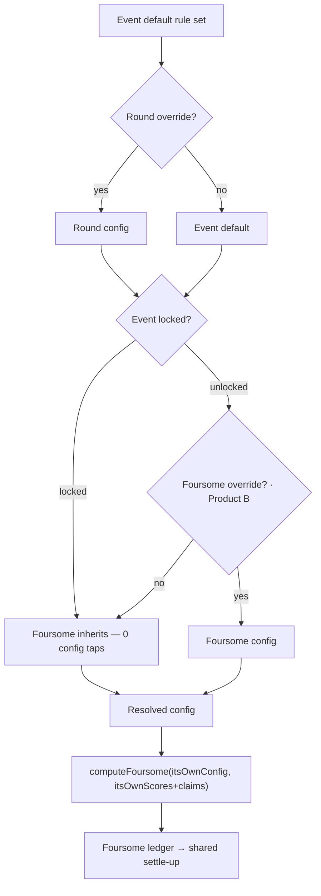
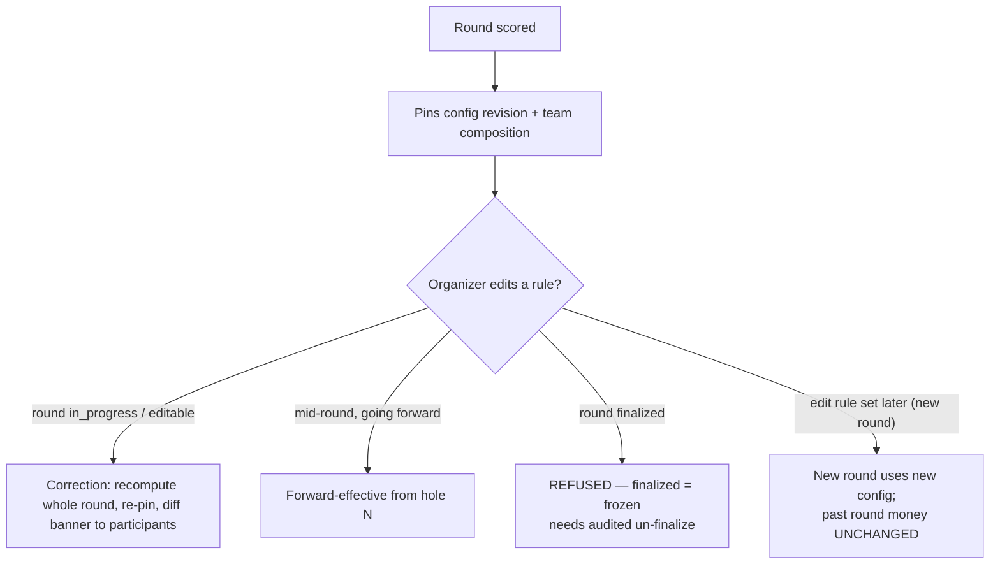

# Product Requirements Document — Tournament F1: Unified "Rules & Games" Configuration Model

**Author:** Josh
**Date:** 2026-06-16
**Scope:** F1 (Rules-config foundation). F1b (player-driven 1v1 bets) and F2/F3 are separate tracks, out of scope here.

## Foundation Decisions & Risk (pre-discovery — from advanced elicitation 2026-06-16)

These are inherited as LOCKS by later PRD steps, not re-opened.

### ADR-F1-1 — Config model is additive; `rule_sets` becomes the preset library
New event/round/foursome **config tables** carry the cascade. The existing tenant-level `rule_sets` / `rule_set_revisions` stay intact as the **seed/preset library** (e.g. "Standard Guyan Game"). Event config *references a rule_set revision id* as its seed; an edit creates a new revision (FD-8 immutability preserved) and re-points. No destructive change to existing rows.

### ADR-F1-2 — Recompute has three edit semantics (reconciles "fix my mistake" with FD-8/FD-13)
- **(a) Correction** — retroactive, allowed ONLY while a round is `in_progress` / `complete_editable`; recomputes the whole round. (Josh's "I meant to turn off net-birdie, recalculate.")
- **(b) Forward-effective** — the existing FD-13 `effective_from_hole` mid-round change machinery (FR-H1).
- **(c) Finalized = frozen** — neither (a) nor (b) touches settled money; changing a finalized round requires an explicit, audited un-finalize (organizer).
- _Rejected: "recompute always (incl. finalized)" — fails data safety; "forward-effective only" — fails the fix-my-mistake requirement._

### Migration — additive dual-read (Path 2) + golden-output backfill gate
New config tables added alongside; events with no new config fall back to today's tenant-rule_set behavior (existing events untouched, reversible). Only new/opt-in events use the cascade. Any event that IS backfilled must pass a **golden-output comparison** (old vs new compute produce byte-identical money) before cutover.

### Scope phasing (promoted from note to decision)
- **Product A (must-ship spine):** admin creates/seeds a rule set ("Standard Guyan Game") + lock toggle; kills the dead "No rule set seeded" card; carries the migration. Locked-trip path = zero-tap inherit.
- **Product B (deferred within F1):** per-foursome self-service unlock + player-facing "Adjust Guyan Game Rules" UI (gated by H1 join identity). Ship when a casual trip actually needs it.

### Risk register (from pre-mortem)
| # | Failure | Prevention |
|---|---|---|
| R1 | Retroactive recompute rewrites a FINALIZED round's settled money | Finalized = frozen (ADR-F1-2c); recompute only on non-finalized |
| R2 | Migration backfill silently changes a live event's 2v2 params | Additive dual-read (existing events untouched) + golden-output gate |
| R3 | Per-foursome unlock changes stake MID-round → earlier holes recompute | Lock foursome config once its round starts (mirror edit-round-course's "refuses after start") |
| R4 | Cap settlement pays >1 person ("you don't lose it ×2" violated) | Loss-less decomposition invariant (same guard that caught the T13-5 half-share bug) |
| R5 | Segmented point value off-by-one at front/back boundary | Golden-fixture test the segment→hole mapping |
| R6 | Cascade resolver misreads lock flag → wrong foursome rules | Golden-fixture test the Event→Round→Foursome resolution incl. lock gate |

## Executive Summary

F1 makes the Tournament app's core wedge — *"the app remembers how this specific group plays golf"* — actually functional. Today that wedge is broken at the most basic level: the admin landing shows a dead, un-clickable "No rule set seeded yet" card, and there is no UI to create or seed a rule set. The app cannot express a group's game, so it cannot be used for real by any group whose game differs from the hardcoded default. **F1 is the demo→usable threshold: without it, Tournament works for one game; with it, a second group can adopt it.**

The job-to-be-done is not "configure rules" — it is **"let me play my real game and trust the money at the end."** The felt value is correctness without mental math, and it is already proven in production: the sibling app (Wolf Cup) demonstrates the exact reaction F1 targets — *"we just put the scores in and it sorts it all out; we're getting spoiled and people really like it."* F1 extends that relief to the math-heaviest contexts: out-of-group head-to-head games (different foursomes, no shared card), multi-round trips/events (manual math compounds), and even the in-foursome Guyan game itself ("a lot of thinking sometimes").

F1 delivers a unified **"Rules & games" configuration model**: an event-wide rule-set default that cascades **Event → Round → Foursome**, behind a single admin lock toggle. The common case is **zero-tap inherit** — the organizer seeds the group's game once (preset-first, never blank-slate) and every foursome plays it. The cascade is **container-agnostic by contract**: its top level is "a container that has rounds," so an ongoing **Season** (the Sunday-group / League shape — persistent roster, weekly rounds, season-long standings) slots onto the same config tables later *without migration*. Building the Season container is explicitly **out of F1 scope** (it is the existing League milestone); F1 only declines to foreclose it, and adds no `season_id` or polymorphic plumbing — the agnosticism lives in the seam. The Season is in fact the purest "config-once" case: rules set in week one, untouched for the year. When a casual trip needs it, the admin unlocks and joined members tune their *own* foursome's 2v2 via a guided, recognition-not-recall flow (gated by the H1 join identity). A "game" is one shape — `{scope, countingRule, pointValue-schedule, cap?, settlement, modifiers[]}` — and a "modifier" is `{type, enabled, variant}`, so new rules are added as data + one resolver, never a schema/UI rewrite.

### What Makes This Special

The defensible moat is **not the rules editor** (any app can add one) — it is the **foursome-internal money boundary**. Because 2v2 money never leaves the foursome (2 losers pay 2 winners), the app can offer *per-group rule variation safely*, with no cross-foursome settlement reconciliation. Competitors that don't model money at foursome granularity structurally cannot offer this. The variant model is already validated by real divergence between two live rulesets: the Standard Guyan Game (sandie = up-and-down for *par*; greenie carryover *on*) and Wolf Cup (sandie = up-and-down for *any* score; greenie carryover *off*) are the *same engine, different variant data* — two presets, not two codebases.

Two invariants protect the felt value: **(1) config cost is paid once, at setup — the on-course experience stays zero-math** (Wolf Cup proved this for a *fixed* game; F1 must not let configurability leak cognitive load onto the course); and **(2) correctness is a test artifact, not a feeling** — every game type and modifier ships a golden-file fixture matching hand-calculation (inheriting NFR-C1/C2), and the same golden outputs gate the data migration.

## Project Classification

- **Type:** Brownfield feature addition to the shipped Tournament v1 (PWA `tournament-web` + Hono/SQLite API `tournament-api`).
- **Domain:** Sports / golf scoring — rules + money engine (the app's deepest domain logic).
- **Complexity:** High. **Data-migration risk: High** — the real hazard is migrating live events off the tenant-scoped `rule_sets` and reconciling retroactive recompute with FD-8 immutable revisions + FD-13 forward-effective edits; the config cascade itself is a solved pattern.
- **Context:** Brownfield; preserves FD-8 (immutable `rule_set_revisions`) and reconciles with FD-13/FR-H1. Ports Wolf Cup's proven *correctness machinery* (per-hole pure compute, golden tests), not its runtime code (FR-G2) or its app-specific rules.
- **Phasing:** Product A (admin create/seed/lock — must-ship spine, carries the migration) → Product B (per-foursome self-service unlock — deferred within F1).

## Success Criteria

### User Success
- **Self-serve seed + lock in ≤5 min** (UX guardrail) — preset-first ("start from Standard Guyan Game"), never blank-slate, and **no asking Josh**. Counts only if the seeded ruleset *reproduces the group's actual game* (golden-match a prior hand-calc).
- **Zero-tap inherit** — in a locked event a foursome plays with **0 config taps** (the "Mark test"). Counts only if the inherited rules are the ones the group actually wanted, and "0 taps" must survive Product B existing.
- **No per-hole math** — scores in → points/money out matching hand-calc, for the group's *actual* game (polies / sandies / greenies / caps / segmented stakes).
- **Intent visibility** — every foursome can see a plain-language summary of its active rules ("Standard Guyan · $5/pt · sandies on · net-birdie on") so config-intent errors are catchable. (Correctness ≠ intent.)
- **The dead "No rule set seeded" card is gone** — always a working create/seed path.
- **(Product B)** When unlocked, a joined member adjusts their *own* foursome's 2v2 via **recognition-not-recall** (pick preset + toggle named modifiers), never free-form.

### Business Success
- **Demo→usable threshold crossed:** a group whose game ≠ the hardcoded default runs a **real trip end-to-end to a settle-up everyone trusts** — the headline business signal, observed in the wild. Concrete proof: a non-default ruleset (Wolf-Cup variants, or Madden's "345" cap) configured and run.
- **Trust outcome:** **zero settle-up disputes / zero manual recalcs** at the next real trip — nobody pulls out a notepad to double-check. The felt-success signal.
- Side-project posture unchanged (no revenue).

### Technical Success
- **Four-mechanic golden coverage** = engine definition-of-done: Standard Guyan (modifiers + stateful greenie carryover), Wolf Cup (variant divergence — sandie "any score", carryover off), Madden's "345" (flat point value + payout cap, $3/pt + $45 max), segmented schedule ($5 front / $10 back). All expressible as **pure config, zero code branches**, golden-matching hand-calc.
- **Adversarial fixtures, not just happy-path:** greenie carryover cascading to a non-par-3, cap landing exactly on the boundary, all-push holes, plus-handicap.
- **Correctness = test artifact** (inherits NFR-C1/C2).
- **Migration safety:** existing events untouched (additive dual-read); any backfilled event passes a byte-identical old-vs-new money comparison before cutover.
- **Recompute safety:** 0 money mutations on finalized rounds; corrections only on non-finalized; capped settlement guarded by the loss-less decomposition invariant. **Recompute-in-the-wild:** a real mid-round correction recomputes correctly (observed, not only unit-tested).
- **Cascade correctness:** Event→Round→Foursome resolution incl. lock gate is golden-fixture tested.
- **Zero Wolf Cup regressions;** tournament suite stays green.

### Measurable Outcomes
| Metric | Target | Verified by |
|---|---|---|
| Money correctness | matches hand-calc: Guyan · Wolf Cup · "345" (flat+cap) · segmented (front/back) | golden fixtures |
| Four-mechanic coverage | all pure config, 0 code branches | golden fixtures |
| Adversarial cases | carryover→non-par-3, cap-on-boundary, all-push, plus-handicap all correct | golden fixtures |
| Migration safety | existing events byte-identical pre/post | old-vs-new comparison harness |
| Finalized-round money mutations | 0 | recompute tests |
| Recompute-in-the-wild | a real mid-round correction recomputes right | observed + recompute tests |
| Zero Wolf Cup regressions | suite green | CI gate |
| Demo→usable (business) | a 2nd group runs a real trip to a trusted settle-up | observed in the wild |
| Trust | zero settle-up disputes / zero manual recalcs | observed in the wild |
| Intent visibility | every foursome can read its active rules in plain language | observed session |
| Seed + lock a trip *(guardrail)* | ≤5 min, self-serve, reproduces actual game | observed session |
| Foursome config taps, locked *(guardrail)* | 0 (survives Product B) | observed session |

## Product Scope

### MVP — Product A (must-ship spine), built in risk-sequenced order
1. **Engine generalization** — the game shape `{scope, countingRule, pointValue-schedule, cap?, settlement, modifiers[]}` + modifier registry `{type, enabled, variant}`. *(Golden-provable on new data, no live-data risk — built first.)*
2. **Admin create/seed a rule set** ("Standard Guyan Game") + event-wide default. *(Kills the dead card.)*
3. **Cascade resolver (Event→Round→Foursome) + single lock toggle.**
4. **Additive dual-read migration** — gated by the byte-identical golden comparison. *(Touches live events only after correctness is proven on new data.)*
5. **Leaderboard mode switch** — money/P&L (locked) vs scores-only + private My Money (unlocked).

### Growth — Product B (deferred within F1)
Per-foursome self-service unlock + player-facing "Adjust Guyan Game Rules" recognition-not-recall UI (gated by H1 join identity) + **cross-group / cross-foursome games** (FR22/FR25) settled via the SettlementEdge IR + player self-reported claims (FR16 self-report).

### Vision (Future)
Container-agnostic **Season** (the Sunday group) · new modifier/game types via the registry (add = data + one resolver) · F1b player-driven 1v1 bets surfacing · rule-set sharing across groups.

## User Journeys

### Journey 1 — Josh the Organizer: seed + lock a trip *(Product A, happy path)*
**Opening.** Josh is setting up the next Pinehurst-style trip. He opens the event admin and — instead of the dead "No rule set seeded yet" card — sees **"Set up Rules & Games."**
**Rising action.** He taps it. It opens **preset-first**: "Start from *Standard Guyan Game*." He confirms the modifiers (net-birdie on, polie on-anything, gross sandie, greenie carryover), sets the point value ($5/pt), names it, saves. He sets each day's **team game** — the intra-foursome 2v2 plus the event-level pot (best-ball-vs-par, $20/man) per FR5; direct cross-foursome head-to-head money is Product B. He leaves foursomes **LOCKED to admin**. The setup also prompts a **handicap-lock reminder** ("Lock handicaps as of: ___") so he doesn't forget — he sets as-of = the Wednesday before (the H1 feature; can be set retroactively since GHIN history is dated).
**Climax.** He doesn't configure anything per-foursome. Every foursome inherits the event rule set automatically — zero further setup.
**Resolution.** Under 5 minutes, self-serve, no spreadsheet. The trip is rules-ready; the locked leaderboard will show money standings.
*Reveals:* rule-set create/seed UI (preset library), modifier config with variants, point-value, team-game config, single lock toggle, the cascade's event-default level, **a handicap-lock setup-flow reminder (cross-ref H1/H1b)**.

### Journey 2 — Madden the casual player: unlock + self-serve *(Product B)*
**Opening.** It's a loose weekend; Josh flips the event to **UNLOCKED**. Madden's foursome plays "345"; the other plays Standard Guyan.
**Rising action.** Madden opens the app (joined earlier by code — H1 identity), lands on his foursome, taps **"Adjust Guyan Game Rules."** Recognition-not-recall: he picks the **"345"** preset (flat $3/pt, $45 cap) from a list and toggles named modifiers — no free-form, no schema.
**Climax.** His foursome plays 345; the next foursome plays Standard; **neither touches the other's money** (2v2 is foursome-internal).
**Resolution.** Two foursomes, two games, one trip, no admin bottleneck, no cross-foursome reconciliation.
*Reveals:* unlock toggle, player-facing adjust flow gated by join identity, per-foursome config, recognition-not-recall preset picker, foursome-internal settlement.

### Journey 3 — Mark the reluctant player: zero-tap inherit *(the "Mark test")*
**Opening.** Locked event. Mark dreads "another app to configure."
**Rising action.** He opens the app — **no config screen ever appears.** He sees the schedule and a plain-language line: *"Your foursome: Standard Guyan · $5/pt · sandies on · net-birdie on."*
**Climax.** He plays. Scores go in, money comes out right. He never thought about rules once.
**Resolution.** The thing that removed friction *added none.*
*Reveals:* zero-tap inherit, **intent-visibility** active-rules summary, no config friction for non-organizers.

### Journey 4 — Josh mid-trip: "I meant to turn off net birdie" *(recompute safety)*
**Opening.** Day 2, mid-round, Josh realizes net-birdie shouldn't be on for this round.
**Rising action.** He edits the rule. Because the round is `in_progress`, it's a **correction** — the engine recomputes the whole round; a diff banner surfaces to participants so nothing drifts silently.
**Climax.** He tries the same edit on *yesterday's finalized* round — the app **refuses** (finalized = frozen); changing it would need an explicit, audited un-finalize.
**Resolution.** Money's corrected where it's safe, protected where it's settled. Nobody's paid-up balance silently changed.
*Reveals:* edit/correction flow, retroactive recompute (non-finalized only), finalized-frozen guard, diff banner, recompute-in-the-wild.

### Journey 5 — Teams, on-course claims, and the breakdown *(Product A, resume-era FRs — 2026-06-21)*
**Opening.** Josh builds the roster, then taps **"Make teams"** and picks **high-low handicap (A/B)** — the app pairs an A-player with a B-player per team (or he chooses random, or drags pairs manually). *(FR20–21.)*
**Rising action.** Day 1, hole 4 (par 3). Ronnie misses the green but gets up-and-down from the bunker. The scorer, entering the foursome's scores, taps **Sandie** on Ronnie's row **inline** — no second screen. On hole 7 a greenie goes unclaimed and **carries** to hole 8. *(FR15–FR16, FR40.)*
**Climax.** At the cart, Stu opens the leaderboard, taps **Ronnie's name**, and sees the per-hole breakdown — "Hole 4: won + sandie = +$X." Every dollar is explained. *(FR41, NFR-T1.)*
**Resolution.** Teams set in seconds, claims captured without breaking flow, money self-explaining — no notepad.
*Reveals:* team-formation methods (FR20), team-as-composition (FR21), inline claim capture (FR16), stateful carryover (FR40), per-hole money breakdown (FR41).

### Journey Requirements Summary
- **Rule-set authoring:** create/seed from a preset library; modifier config `{type, enabled, variant}`; point-value (flat + segmented) + cap; team-game config. *(J1)*
- **Cascade + lock:** Event-default → Round → Foursome resolution; single admin lock toggle; zero-tap inherit as default. *(J1, J3)*
- **Player self-service (Product B):** unlock-gated, identity-gated "Adjust Guyan Game Rules"; recognition-not-recall preset picker; foursome-internal settlement isolation. *(J2)*
- **Intent visibility:** plain-language active-rules summary per foursome. *(J3)*
- **Edit/recompute:** correction (non-finalized, retroactive) vs forward-effective; finalized-frozen guard; diff banner. *(J4)*
- **Leaderboard mode:** money standings when locked, scores-only + private My Money when unlocked. *(J1, J2)*
- **Teams, claims & breakdown:** team-formation methods + team-as-composition (FR20–21); inline greenie/polie/sandie capture + carryover (FR16, FR40); per-hole money breakdown (FR41). *(J5)*
- **Handicap-lock setup touchpoint** *(cross-ref H1/H1b, not F1 build):* the setup flow reminds the organizer to lock handicaps as-of a date; lock is correct retroactively (GHIN dated history); future-dating needs the scheduled-lock enhancement (H1b).

## Domain-Specific Requirements

### Compliance & Regulatory
- **None.** Golf side-game scoring; no regulated data class; no in-app payments (cash settle-up off-app). Matches the v1 PRD "no regulatory burden."

### Domain Patterns (golf money engine)
- **Deterministic pure engines, integer cents** — all money computed by pure functions of (scores + claims + config); no floats; recompute is reproducible (inherits the v1 deterministic-engine discipline + Wolf Cup; see NFR-C2/C6).
- **Foursome-isolation is STRUCTURAL, by signature** — the per-foursome money compute takes only *that* foursome's config + *its own* four players' scores **and claims**: `computeFoursome(itsOwnConfig, itsOwnScores+claims) → foursomeLedger`. The engine cannot read another foursome's config, so cross-foursome contamination is **unrepresentable** — the safety property the entire unlock feature relies on is enforced by the type/signature, not merely by a test.
- **Slope-aware course-handicap allocation (hard reuse pointer)** — any F1 game/modifier that computes a *net* score MUST import the existing allocation: `calcCourseHandicap` / `allocateNetThroughHole` (`services/handicap.ts`), `getHandicapStrokes` (`engine/handicap-strokes.ts`), `buildTeeByPlayer` (`services/per-player-tee.ts`). **Zero new allocation math** — reimplementing net resurrects the `Math.round(HI)`-wrong-on-non-blue-tees bug family.
- **Loss-less decomposition** — combined and split ledgers sum to the identical total; caps never double-pay (the T13-5 half-share invariant).

### Testing the Invariants (property tests, not just examples)
Golden fixtures cover *examples*; **property/fuzz tests** cover the *invariants*, across arbitrary configs:
- **Isolation:** for any two foursomes with any configs, changing foursome B's config never moves foursome A's ledger.
- **Loss-less decomposition:** `sum(splits) == combined` for all inputs.
- **Cap-never-exceeds:** settled payout ≤ cap, always.

### Technical Constraints
- Edits recompute via the pure engines; **finalized = frozen**; correction only on non-finalized (ADR-F1-2).
- **H1 non-regression:** the shipped locked-handicaps overlay (`event-handicap-overrides`) must continue to apply under the new config model — F1 must not regress handicap-lock.

### Risk Mitigations
- See the Foundation **Risk register (R1–R6)**: finalized-frozen, additive dual-read + golden gate, foursome-lock-on-start, loss-less invariant, segment/cascade golden fixtures.

## PWA + API Specific Requirements

### Data Model (additive — ADR-F1-1)
- **`rule_sets` / `rule_set_revisions`** *(existing, tenant-scoped)* → the **preset library**. Revision `config` JSON extended to the game shape `game = {scope, countingRule, pointValue-schedule, cap?, settlement, modifiers[]}`, `modifier = {type, enabled, variant}`. Immutable-revision pattern (FD-8) unchanged.
- **`event_game_config`** *(new, Product A)* — per event: `event_id`, `seed_rule_set_revision_id`, `lock_state` ('locked'|'unlocked'), `team_game_config`, ecosystem columns (FD-6).
- **`round_game_config`** *(new, Product A)* — per-round override: the daily team game + any round-level rule overrides (admin sets the team game each day).
- **`foursome_game_config`** *(new, Product B only)* — FKs **`pairings.id`** (existing T4-2); scoped to *(round, foursome-slot)*, re-inherited each round as pairings reshuffle; **locked once the round starts** (R3).
- **Team composition** *(new, Product A — FR20–21)* — formed from the roster (manual / random / high-low HI A/B). A scored round **pins its team composition** alongside the config revision (FR29 / NFR-D1) so re-teaming never rewrites past money. *(Open for architecture: a dedicated `team` / `team_member` store vs deriving + pinning from `pairing_members` slot order, which is how teams are read today.)*
- *(Open for architecture: `round_game_config` + `foursome_game_config` could collapse into one `(level, ref_id, config)` override table.)*
- **Dual-read migration:** events with no `event_game_config` fall back to today's tenant-`rule_sets` behavior (existing events untouched; reversible).

### Durable History & Config Provenance
- **Per-round pairings are append-only** — re-pairing for a later round never overwrites an earlier round's "who was in which foursome." (Round 6.16.100 with X; round 6.16.102 with Y — both retained forever.)
- **A scored round pins the config revision it was computed under** — exactly as rounds pin `course_revision_id` today ("course durable across re-tees"). Editing a rule set later does NOT change a past round's money; a new round picks up new config. Only a *correction* (ADR-F1-2a) re-pins. This is the spine for cross-event stats.

### Engine (pure, registry-based)
- **`resolveConfig(event, round, foursome)`** — cascade resolver, most-specific-wins (Foursome→Round→Event default), gated by `lock_state`. Golden-tested incl. lock gate (R6).
- **`computeFoursome(itsOwnConfig, itsOwnScores+claims) → foursomeLedger`** — structural isolation (cannot read another foursome's config).
- **Modifier/game registry** — `register(type, resolver)`; add a rule = data + one pure resolver (no schema/UI change).
- Net scoring imports the existing slope-aware allocation (`calcCourseHandicap`/`allocateNetThroughHole`/`getHandicapStrokes`/`buildTeeByPlayer`) — zero new allocation math.
- **Recompute reuses the existing post-score-commit path** (press-orchestrator/money) — no new trigger.

### API Endpoints
- **Admin (organizer + event-scoped):** rule-set CRUD / list presets; `GET`/`PUT /api/admin/events/:eventId/game-config` (seed preset, lock toggle, team game); `PUT …/rounds/:roundId/game-config`; `GET …/events/:eventId/resolved-config` (mirrors the `admin-context` route shape).
- **Player (Product B, gated):** `GET`/`PUT /api/events/:eventId/foursomes/:foursomeId/game-config` — gated by **event-unlocked AND requireSession (Google or H1 device bridge) AND member-of-this-foursome AND round-not-started**.
- **Edit/recompute:** PUT applies correction (non-finalized) or forward-effective per ADR-F1-2; **finalized rounds reject WITH an explanation** ("This round is finalized — money is locked. Un-finalize to change.").

### Web UI (PWA, design-system primitives + dark-mode tokens)
- **Admin "Rules & Games" setup** — preset-first ("Start from Standard Guyan Game"), modifier toggles + variant pickers, point-value (flat + segmented), cap, team-game config, **single lock toggle**. Replaces the dead "No rule set seeded" card.
- **Intent-visibility** — plain-language active-rules summary per foursome (on the round/leaderboard view).
- **Player "Adjust Guyan Game Rules"** *(Product B)* — recognition-not-recall preset picker + named-modifier toggles; never free-form.
- **Leaderboard mode** — money/P&L (locked) vs scores-only + private My Money (unlocked), with a visible mode signpost.
- **Finalized-frozen message** — explanatory, not a bare refusal (Sally).

### Auth
- Organizer routes: `requireSession` + `requireOrganizer` + event-scoped `isEventOrganizerByEventId`.
- Player routes (Product B): `requireSession` (Google **or** H1 device binding) + event-participant + foursome-membership + unlock gate + round-not-started.

### Provenance Regression Tests (named)
- (a) Edit a rule set *after* a round is scored → that round's money is unchanged (pinned); a new round uses the new config.
- (b) Correction on a non-finalized round re-pins + recomputes.
- (c) Finalized-round edit is rejected.

### Required Clarity Artifact
The architecture/PRD must include a **diagram** of: cascade resolution (Event-default→Round→Foursome, gated by lock) + the edit-semantics decision (correction | forward-effective | frozen) + the pin/re-pin lifecycle — plus a plain-language definition of "config provenance." (Prevents the "I fixed the rule, why didn't last week's money change?" confusion — which is *correct* behavior.)

**Config provenance (plain language):** a scored round *remembers* the exact rules + teams it was computed under (it "pins" them). Editing the rule set later changes *future* rounds, not past ones — so last week's money is intentionally unchanged. Only an in-progress **correction** re-pins and recomputes a round.

**Diagram 1 — Cascade resolution (most-specific-wins, gated by lock):**

**Diagram 2 — Edit semantics + pin/re-pin lifecycle:**

### Forward-Compatibility — NOTE ONLY, zero F1 build
These shape v1 schema (don't-foreclose), they are NOT F1 work:
- **Money is NEVER public.** Two visibility tiers: (1) **Money** — bounded to your group (FR-D9 posture), with an event/season total surfacing to another group ONLY by the player's manual per-group approval; (2) **Public/cross-user stats** — performance only (avg by par 3/4/5, birdies, …), **never any dollar figure**. The tiers must stay structurally separable.
- **Public/private profiles** — default **private**, opt-in; per-player + retroactive (flip-to-private hides history too); "who I played with" data about another player respects *their* visibility (mutual-visibility boundary). Builds on cross-event stats (v1.5+ Vision).

### Implementation Considerations
- Drizzle migration: additive tables, `--> statement-breakpoint` between every statement; plain `ADD COLUMN`/`CREATE TABLE` (no CHECK-driven table rebuilds — the T13-4 gotcha).
- Risk-sequenced build order: engine + seed → cascade + lock → migration (golden-gated) → leaderboard mode → Product B.

## Project Scoping & Phased Development

### MVP Strategy & Philosophy
- **Approach: problem-solving MVP.** The minimum that makes the app usable by a *second group* — crossing the demo→usable threshold. Ship the smallest thing that lets a group whose game ≠ the default run a real trip to a settle-up they trust.
- **Resource model:** solo dev (Josh + Claude), port-and-generalize discipline (reuse Wolf Cup's proven correctness machinery).

### MVP Feature Set (Phase 1 = Product A)
- **Journeys supported:** J1 (organizer seed + lock), J3 (zero-tap inherit / "Mark test"), J4 (mid-trip correction). *(J2 unlock → Phase 2.)*
- **Must-have capabilities:** pure engine + modifier/game registry · admin create/seed rule-set UI (preset-first) · `event_game_config` + `round_game_config` · cascade resolver + lock toggle · additive dual-read migration (golden-gated) · leaderboard mode (money vs scores) · finalized-frozen with explanatory message · per-round config-provenance pinning · intent-visibility active-rules summary · **score + claim capture (greenie/polie/sandie) incl. edit/remove (FR16/FR39) + stateful carryover (FR40)** · **team formation incl. random/high-low/manual picker (FR20–21)** · **per-hole money breakdown view (FR41)** · **finalize / audited un-finalize (FR43)** · **fail-closed/unsettleable surfacing (FR44)**.

### Post-MVP
- **Phase 2 (Product B):** per-foursome unlock · player "Adjust Guyan Game Rules" recognition-not-recall UI · `foursome_game_config` · cross-group/cross-foursome games (FR22/FR25) · player self-reported claims (FR16).
- **Phase 3 (Vision):** container-agnostic **Season** (Sunday group) · new modifier/game types via the registry · F1b player-driven 1v1 bets surfacing · public/private profiles (money-never-public) · cross-event stats · rule-set sharing.

### Risk Mitigation Strategy
- **Technical:** additive dual-read + golden-output backfill gate · structural foursome isolation · reuse slope-aware allocation · finalized-frozen recompute (R1–R6).
- **Market/adoption:** the demo→usable threshold is the validation — one real trip on a non-default ruleset run to a trusted settle-up = proof.
- **Resource (solo dev):** risk-sequenced build order makes Phase 1 independently shippable + validatable before Product B; each phase stands alone.

---

> **Note:** Everything above (Foundation → Project Scoping) is the original spine (authored 2026-06-16). The Functional + Non-Functional Requirements below were authored on resume (2026-06-21); decisions ratified since the pause are tagged **🆕** in the FR list.

## Functional Requirements

> **Capability contract.** UX, architecture, and epics implement ONLY what's here. Tags: **🆕** = added on resume (2026-06-21); **(B)** = Product B (Growth, deferred within F1); **(note)** = forward-compat, zero F1 build. Untagged = Product A (must-ship MVP). FR list validated via Party Mode (PM/Architect/QA/UX/Analyst) + Codex review. (Business/trust success criteria — demo→usable, zero settle-up disputes — are validated *outcomes*, not FRs; correctness criteria map to the NFRs.)

### A. Rule-Set Authoring & Preset Library
- FR1: An organizer can create an event's rule set by starting from a preset (never blank-slate).
- FR2: An organizer can enable/disable each modifier (net-birdie point, polie, sandie, greenie) and choose its variant (e.g. sandie = up-and-down for par vs any score; greenie carryover on/off).
- FR3: An organizer can set a game's point value as flat ($/pt) or a segmented schedule (e.g. $5 front / $10 back); segments map to holes explicitly (front 1–9 / back 10–18), defined for 9-hole rounds and the round's play sequence (golden-tested at the boundary, R5).
- FR4: An organizer can set a payout cap and how a capped payout resolves (e.g. "345" — $3/pt, $45 max).
- FR5: An organizer can configure team games at two MVP scopes — the **intra-foursome 2v2** (foursome-internal money) and an **event-level pot/standing** (e.g. best-ball-vs-par winner-take-all, aggregated across teams). Direct **cross-foursome head-to-head money** is FR22/FR25 (Product B).
- FR6: An organizer can name and save a rule set as a reusable preset.
- FR7: The system maintains a selectable preset library (Standard Guyan, Wolf-Cup variant, "345").

### B. Configuration Cascade & Lock
- FR8: An organizer can set an event-wide default rule set that rounds/foursomes inherit.
- FR9: An organizer can override the rule set / team game at the round level.
- FR10: An organizer can lock/unlock foursome configuration with a single toggle.
- FR11: In a locked event, a foursome plays inherited rules with zero config taps.
- FR12: The system resolves active config for any (event, round, foursome), most-specific-wins, gated by lock state.
- FR13 **(B)**: When unlocked, a joined foursome member can adjust their own foursome's game via preset + named-modifier toggles (recognition-not-recall).
- FR14 **(B)**: A foursome's config locks once its round starts.

### C. Score & Claim Capture (the Guyan inputs)
- FR15: A scorer can enter each player's gross score per hole.
- FR16 🆕: The round's **scorer** records per-player, per-hole **greenie / polie / sandie** claims. Claims are **accepted as entered** — the system does NOT validate eligibility (e.g. greenie-only-on-par-3) in v1; correctness is the group's (trust + audit). Claims inherit scores' single-writer + offline-dedup contract; player self-report deferred (B).
- FR17 🆕: All scores and claims attach to the **individual player** (atomic unit), independent of team/foursome — re-teaming recomputes with no re-entry.
- FR18: A scorer can record putts per player per hole (for putting-based games).
- FR19: Score/claim entry works offline and reconciles on reconnect.
- FR39 🆕: A scorer can **edit or remove** a previously recorded greenie/polie/sandie claim on a non-finalized round.

### D. Teams
- FR20 🆕: An organizer can form teams from the roster via **manual, random, or high-low handicap-index (A/B)** selection.
- FR21 🆕: A team is a late-bound composition of players; changing membership recomputes dependent games/money with no re-entry.
- FR22 🆕 **(B)**: A team/matchup can span foursomes (cross-group), not only within one foursome.

### E. Money Settlement Engine
- FR23: The system computes each foursome's ledger from *its own* players' scores + claims + resolved config (structural foursome-internal isolation).
- FR24: The system settles the Guyan game (low-ball / team-total / net-birdie points / modifiers) into **real money**, per round and per event.
- FR25 🆕 **(B)**: The system settles cross-group team games as **player-to-player SettlementEdges** — a distinct path that never reads another foursome's config (preserves FR23 isolation) and feeds the one shared settle-up.
- FR26: Capped games never exceed the cap; a combined ledger and its splits always sum to the identical total (loss-less, no double-pay).
- FR27: Net-scoring games compute net from the event's **locked, slope-aware course handicap**, applied consistently across every game (no per-game handicap divergence).
- FR28: Every participant in a game appears in the settle-up with their net position. (Non-playing **backers** are a betting / "The Action" concept — already shipped — not F1.)
- FR40 🆕: The system supports **stateful modifiers** whose outcome carries across holes (e.g. greenie carryover when unclaimed) — golden-tested incl. carryover onto a non-par-3.
- FR42 🆕: Every game resolves **ties / pushes / halves deterministically** per its configured rule (hole halved, point split or none, or carryover) — golden-tested.
- FR44 🆕: When required data is missing or untrustworthy (no handicap, DNF/pickup, incomplete holes), a game **fails closed** — marked unsettleable and surfaced for organizer resolution — never settled on a guess.

### F. Edit, Recompute & Provenance
- FR29: A scored round pins **both the config revision AND the team composition** it was computed under — later rule edits or re-teaming (FR21) don't change a past round's money; a new round uses the new config/teams.
- FR30: An organizer can apply a **correction** to a non-finalized round (recomputes the whole round).
- FR31: An organizer can apply a **forward-effective** rule change mid-round (from a given hole).
- FR32: The system refuses money-changing edits to a finalized round (frozen), with an explanation; changing it needs an audited un-finalize.
- FR33: A correction surfaces a diff/notice to affected participants (nothing changes silently).
- FR43 🆕: An organizer can **finalize** a round (freezes its money) and **un-finalize** it (audited) to re-enable corrections.
- FR45 🆕: Every money-affecting input or edit (score, claim, config change, finalize/un-finalize) is **audit-logged** with actor + timestamp.

### G. Standings, Visibility & Migration
- FR34: A viewer sees money/P&L mode when locked, scores-only (+ private My Money) when unlocked, with a mode signpost. Money/P&L is **audience-bounded to roster members of the group** (non-roster / cross-group viewers never see dollar figures — FR36).
- FR35: Every foursome can read a plain-language summary of its active rules (intent visibility).
- FR41 🆕: A viewer can see a **per-hole money/points breakdown** for a player/foursome (which scores + claims paid what) — intent-visibility + the leaderboard drill-down.
- FR36 **(note)**: Money is never public — group-bounded money vs performance-only stats stay structurally separable.
- FR37: An organizer can adopt the new config model with existing events untouched (additive); a migrated event's money is byte-identical old-vs-new before cutover.
- FR38: The Rules & Games setup flow reminds the organizer to lock handicaps as-of a date (cross-ref H1).

## Non-Functional Requirements

> **Selective** — only attributes that matter for a real-money golf engine on a private PWA. **Scalability and heavy compliance are intentionally omitted** (small private group; cash settle-up is off-app; no regulated data). Validated via Party Mode (Architect/QA/UX/Analyst/Dev) + Codex review. The defining attribute is **money correctness**.

### Correctness & Money Integrity *(defining attribute)*
- NFR-C1: Every game type + modifier ships a **golden-file fixture matching hand-calculation**; settlement is byte-identical to the fixture (engine definition-of-done).
- NFR-C2: Money is computed in **integer cents by pure functions** of (scores + claims + config); no floats; identical inputs → identical output.
- NFR-C3: **Property/fuzz invariants** hold for all configs (foursome isolation, loss-less decomposition `sum(splits)==combined`, cap-never-exceeds) — via `fast-check`.
- NFR-C4: **Adversarial fixtures** pass — greenie carryover→non-par-3, cap-on-boundary, all-push hole, plus-handicap, segmented front/back boundary.
- NFR-C5: **Zero money mutations on finalized rounds** (recompute only on non-finalized).
- NFR-C6: Settlement output is **order-independent** — invariant to map/iteration/insertion/sort order (stable sorts); property-tested. *(Closes the alphabetical-teams / runtime-round-pick bug class.)*
- NFR-C7: **Rounding/remainder is explicit and deterministic** — splits and capped payouts allocate leftover pennies by a fixed rule; the total is always conserved (no penny created or lost), property-tested alongside loss-less decomposition (C3).
- NFR-C8: **Time-based decisions use a well-defined clock/timezone** — handicap as-of dates resolve against dated GHIN history (H1, proven), and round start / finalize / forward-effective-hole timing are unambiguous across timezones.
- *(Note: C1 happy-path goldens and C4 adversarial goldens are complementary; C2 purity/no-float and C6 order-independence are complementary — not redundant.)*

### Auditability & Traceability
- NFR-T1: Every settled dollar is **traceable** to the scores + claims + config that produced it; the per-hole breakdown (FR41) reconciles exactly to round + event totals. No unexplainable money.

### Durability
- NFR-D1: Money-relevant history is **never overwritten** — pinned config + team revisions (FR29) and append-only pairings persist; a re-pair or rule edit never destroys a prior round's provenance.
- NFR-D2: Money-affecting writes are **atomic** — a settlement, or a score/claim/config mutation that touches multiple rows, commits all-or-nothing; a partial failure leaves no half-applied money (single transaction, inherits the betting tx discipline).
- NFR-D3: Money-relevant data is **backed up on a regular cadence and recoverable**; because money is recomputed (pure) from durable inputs (scores + claims + config + pairings), it is fully **reconstructable from those inputs** after a restore (no separate money-state to lose).

### Migration Safety
- NFR-M1: Existing events untouched (additive dual-read); backfilled events pass an **automated, CI-runnable** byte-identical old-vs-new money comparison before cutover; reversible.

### Performance
- NFR-P1: Score/claim entry echoes input within ~100ms on a mid-tier phone; a hole save commits + advances without blocking the next entry.
- NFR-P2: Leaderboard / money standings render **<2s warm**; recompute-on-score-commit doesn't degrade entry responsiveness.

### Reliability & Offline
- NFR-R1: Score/claim entry works **fully offline** and reconciles deterministically on reconnect (idempotent via clientEventId — no double-write, no loss).
- NFR-R2: **Correction-recompute correctness is an automated test gate.** (Field "recompute correct in the wild" is tracked as a success signal, not a CI gate.)
- NFR-R3: **Concurrency is safe** — concurrent scoring across different foursomes is independent (no cross-foursome corruption); within a foursome, single-writer + idempotent clientEventId dedup prevents conflicts; a config edit during scoring resolves via the edit-semantics (correction / forward-effective / frozen), never a silent overwrite.

### Observability & Error Surfacing
- NFR-O1: **Fail-closed / unsettleable games (FR44) and recompute failures are surfaced to the organizer** (never silent) and logged with enough context to diagnose — a game that can't be graded is visible, not silently missing from the money.

### Security & Privacy
- NFR-S1: Money/P&L is visible only to **authenticated roster members of the group**; non-roster / cross-group never receive dollar figures (structurally separable from performance-only stats).
- NFR-S2: Money mutations (config/score/claim/finalize) require an **authenticated session** (Google OAuth or the H1 device-binding bridge — the accepted participant identity-assurance level), are **CSRF-protected**, **role-authorized** (organizer routes; Product-B player routes gated by unlock + foursome membership + round-not-started), and **audit-logged with the actor**.

### Maintainability & Extensibility
- NFR-X1: A new modifier/game type = **data + one pure resolver** (registry) — no schema or UI rewrite.
- NFR-X2: **Zero Wolf Cup regressions**; the tournament + engine + wolf-cup suites stay green (CI gate).
- NFR-X3: Net scoring reuses the **single existing slope-aware allocation** (no duplicate handicap math).

### Accessibility & On-Course Usability
- NFR-A1: On-course UI meets the shipped floor — ≥44–48px tap targets, 16px input (no iOS zoom), AA sunlight contrast, one-handed phone use.
- NFR-A2: **Zero-math invariant** — config is paid once at setup; a locked foursome plays with **0 config taps** on course.
- NFR-A3: In an observed session, a non-technical player reads the active-rules summary (FR35) and correctly states their game **without help**; claim capture lives inside the score-entry flow (no second screen).
